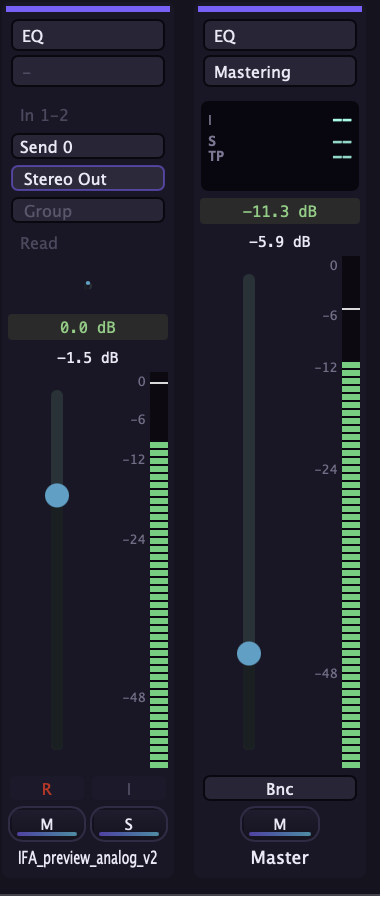

# Backline (formerly Layback Station)

A native **music-to-picture editor**: a hybrid video editor and DAW built for the job of
fitting music to locked picture. Drop in a finished video, audition and cut candidate
tracks against it, mix, and export the mix back against picture.

> "Layback" is the post-production term for laying final mixed audio back onto the master
> video. The app now ships under the name **Backline**.

**Native C++ / JUCE, macOS.** Packaged as a `.dmg` and in testers' hands.

The wedge: Logic Pro allows one video per project. A music house evaluating library tracks
against several brand videos has to open a separate session per video. Backline holds
multiple videos and many candidate tracks in one session.


*Mid-playback, bar 5|1 at timecode 00:00:08:0. Two videos — a brand spot and a montage —
sit in the same session with three candidate tracks, all scrubbing against one transport.
That is the thing Logic will not do.*

---

## Why this project is here

Most of my work is React and Python. This one runs against a real-time audio callback, and
the constraints are completely different: no allocations on the audio thread, no locks
between the UI thread and the render thread, no garbage collector to save you. Plugin
delay compensation and broadcast loudness are not framework calls, they are arithmetic you
have to get right.

## What is implemented

**Mixing and routing**
- Bus routing from the channel-strip output slot, Logic-style, each bus with its own
  fader, mute, and effects (branded "Submix")
- **Plugin delay compensation** across tracks and buses
- Channel-strip inspector for the selected track and master

**Metering and export**
- **BS.1770 / EBU R128 loudness**: LUFS and true-peak metering, loudness-normalized
  export, and stems export
- Cue ranges with an exportable cue list



Track and master strips during playback: the selected track peaking at **-1.5 dB** into a
master sitting at **-11.3 dB** with a **-5.9 dB** peak. Above the master fader are the
three readouts broadcast delivery is graded on — **I** (integrated), **S** (short-term),
**TP** (true peak). Delivery specs are written in LUFS, so on this bus the meter is the
feature and the fader is the afterthought.

<br clear="right">


**Editing**
- Pitch-shift clips by semitone (SoundTouch), baked and persisted into the project
- Edit tools that change the cursor per mode: trim, grab, scrub, zoom
- Multi-format counter: timecode, minutes:seconds, bars and beats, feet+frames (35mm), and
  samples, with drag-on-LCD tempo and a session start-timecode offset

**Video**
- AVFoundation / VideoToolbox decode and playback (`src/VideoView.mm`)

**Shell**
- Three skins: Logic, Pro Tools, and Backline's own glassy indigo identity
- Guided onboarding tour with a spotlight walkthrough
- Packaged `.dmg` plus a tester install guide (`docs/TESTER_README.md`)

## Stack

| Layer | Choice |
|---|---|
| App framework | JUCE (C++) |
| Audio engine | [Tracktion Engine](https://github.com/Tracktion/tracktion_engine) |
| Video decode | AVFoundation / VideoToolbox via an Objective-C++ bridge |
| Time-stretch and pitch | SoundTouch |
| Media tooling | FFmpeg |
| Project format | [OpenTimelineIO](https://opentimelineio.readthedocs.io/) (Apache-2.0) |

Every library was picked so the app can ship commercially. `docs/DECISIONS.md` records
those calls with sources.

## Structure

```
src/
  Main.cpp                  app entry
  AudioEngine.{h,cpp}       transport, routing, buses, PDC
  TimelineComponent.{h,cpp} timeline UI and editing
  VideoView.{h,mm}          AVFoundation video playback
  MixerView.h               mixer surface
  LoudnessMeter.h           BS.1770 / R128 LUFS and true peak
  NativeEffects.h           built-in processors
  StemSplitter.h            stem export
  Skin.h                    skin system
  LogicControlBar.h         Logic-style transport
  ProToolsControlBar.h      Pro Tools-style transport
  BacklineControlBar.h      Backline transport and counter
  LogicInspector.h          channel-strip inspector
  TourOverlay.h             onboarding spotlight
docs/
  VISION.md                 what it is, who it is for, the wedge
  ARCHITECTURE.md           how it is built
  ROADMAP.md                phases and MVP scope
  DECISIONS.md              technical and licensing calls, with sources
  DAW_FEATURE_GAP.md        audit against Reaper, Ardour, Nuendo, Pro Tools
  DISTRIBUTION.md           packaging and release
  TESTER_README.md          install guide shipped inside the DMG
```

## Build

Requires macOS, Xcode Command Line Tools, CMake, and FFmpeg (`brew install ffmpeg`).
Third-party dependencies live in `external/` and are not committed.

```bash
cmake -B build -DCMAKE_BUILD_TYPE=Release
cmake --build build
./package.sh          # produces Backline.dmg
```

## Status

In active development, and further along than a phase label would suggest: it builds, it
packages, and testers are running it. Not Apple-notarized yet, so first launch uses the
right-click Open path documented in the tester guide. The current build is Intel and runs
on Apple Silicon under Rosetta; a native ARM build is on the list.

## Team

- **Harrison** — video side, product, and the app itself
- **DB**, **Scott** — audio/DAW collaborators

Repo maintained by [Harrison C. Songolo](https://xkaii.studio).
